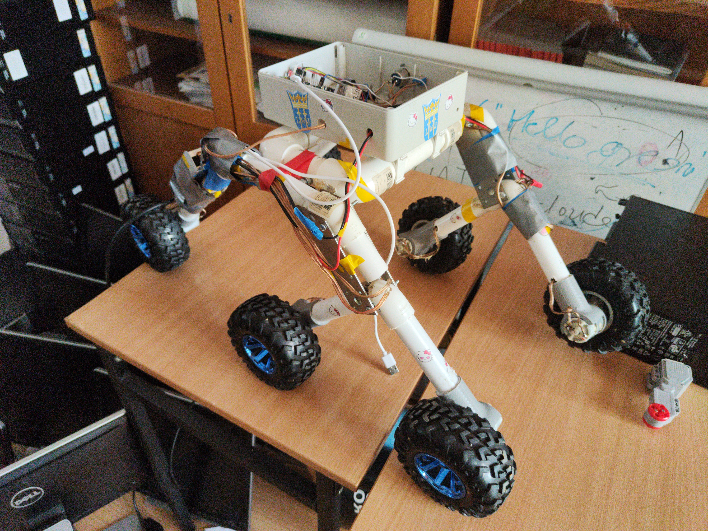
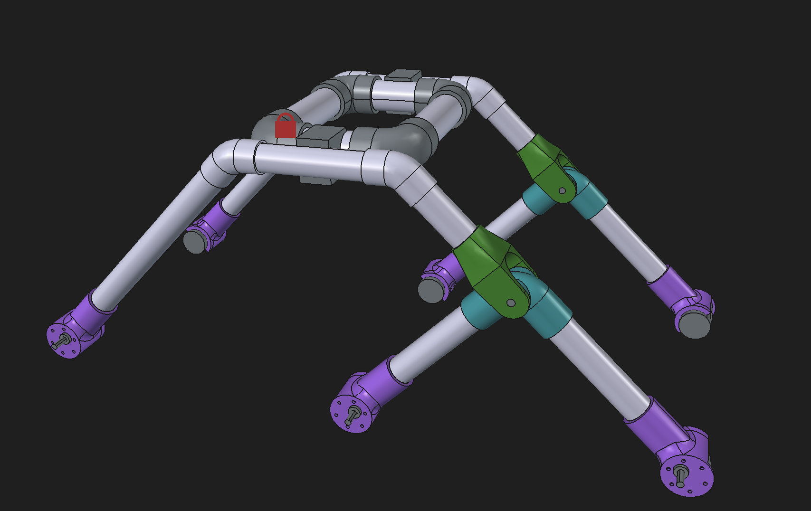
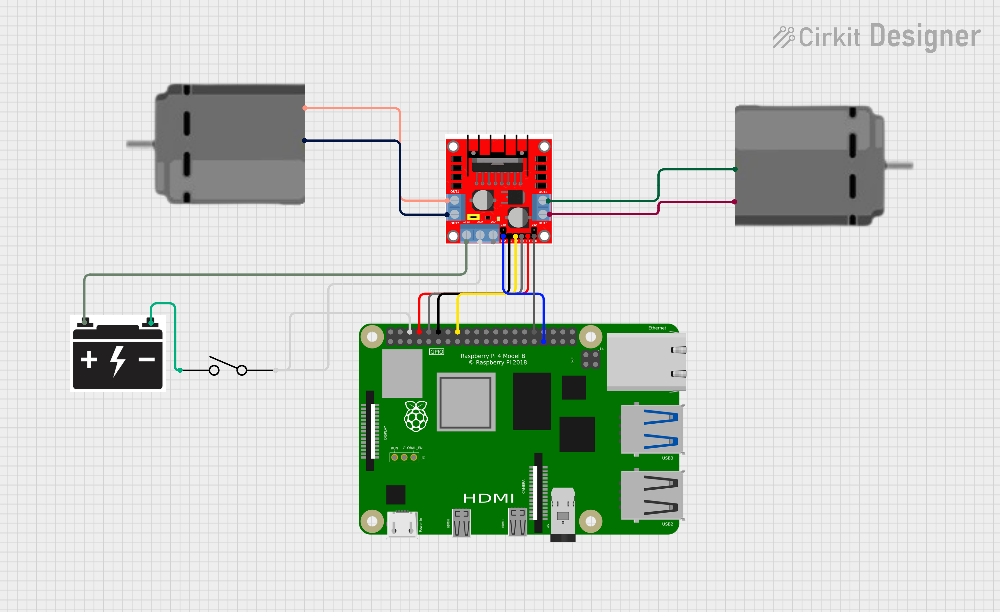
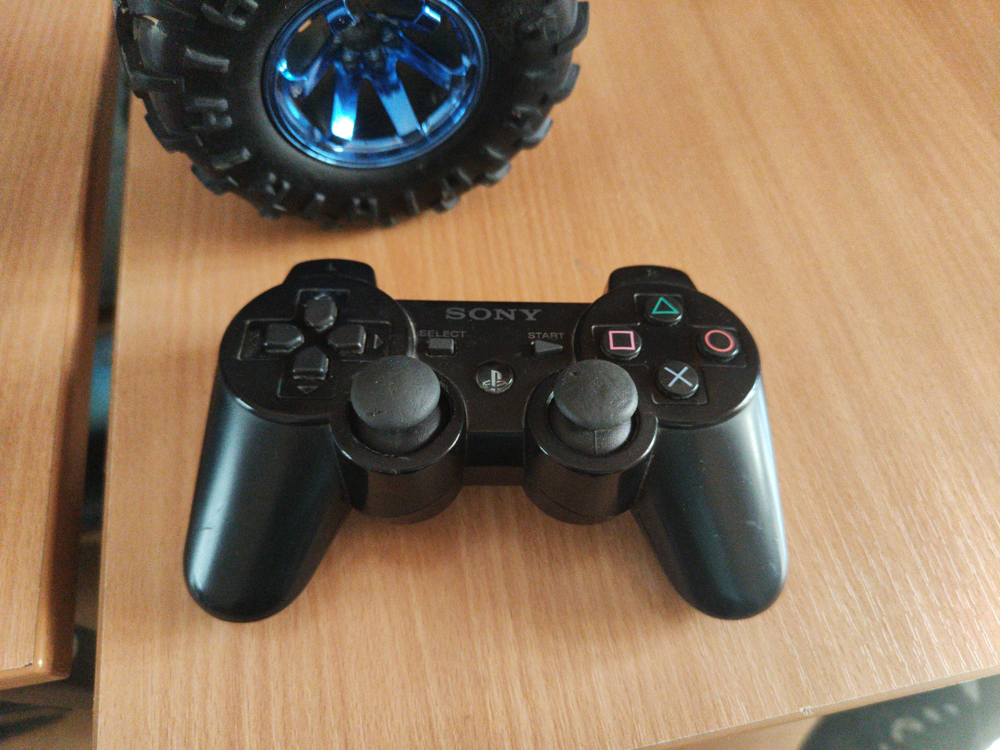
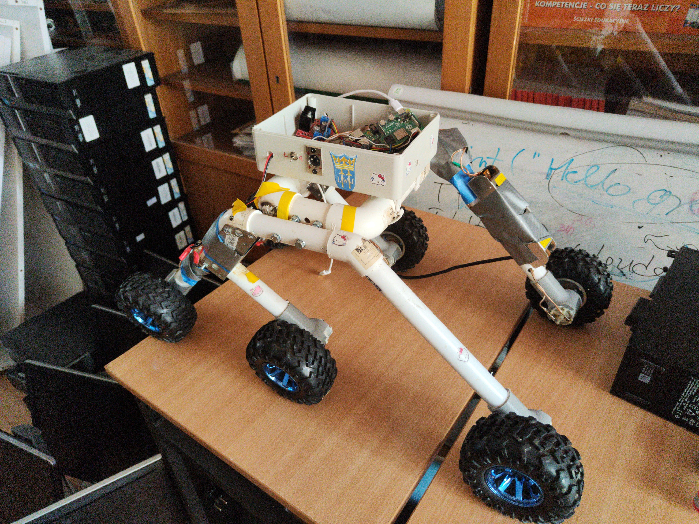
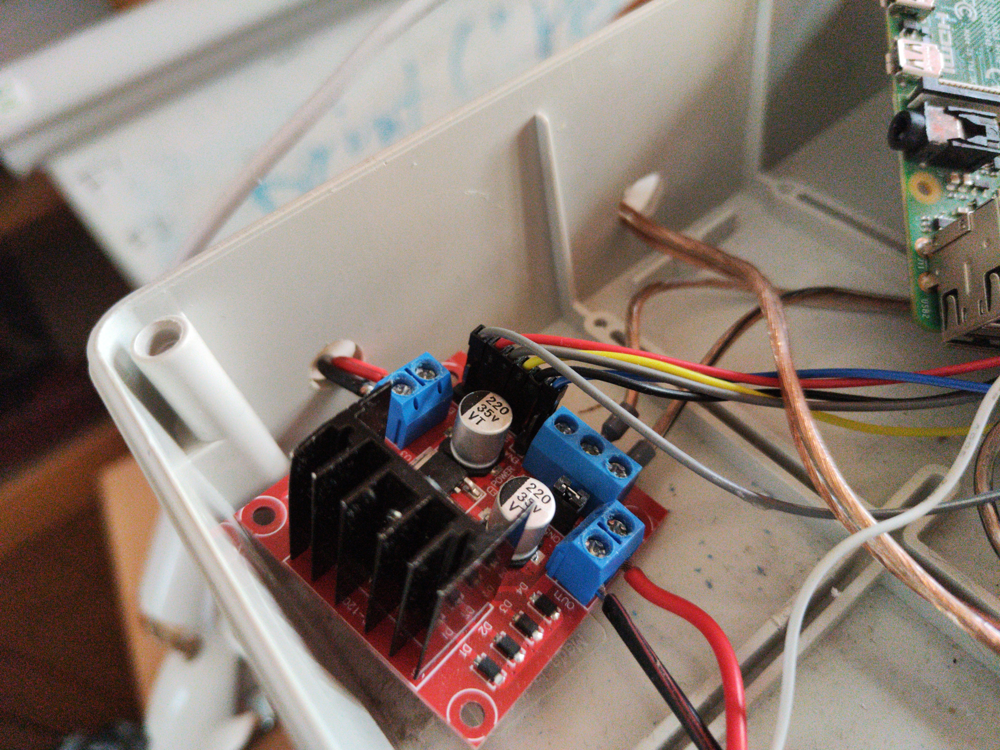
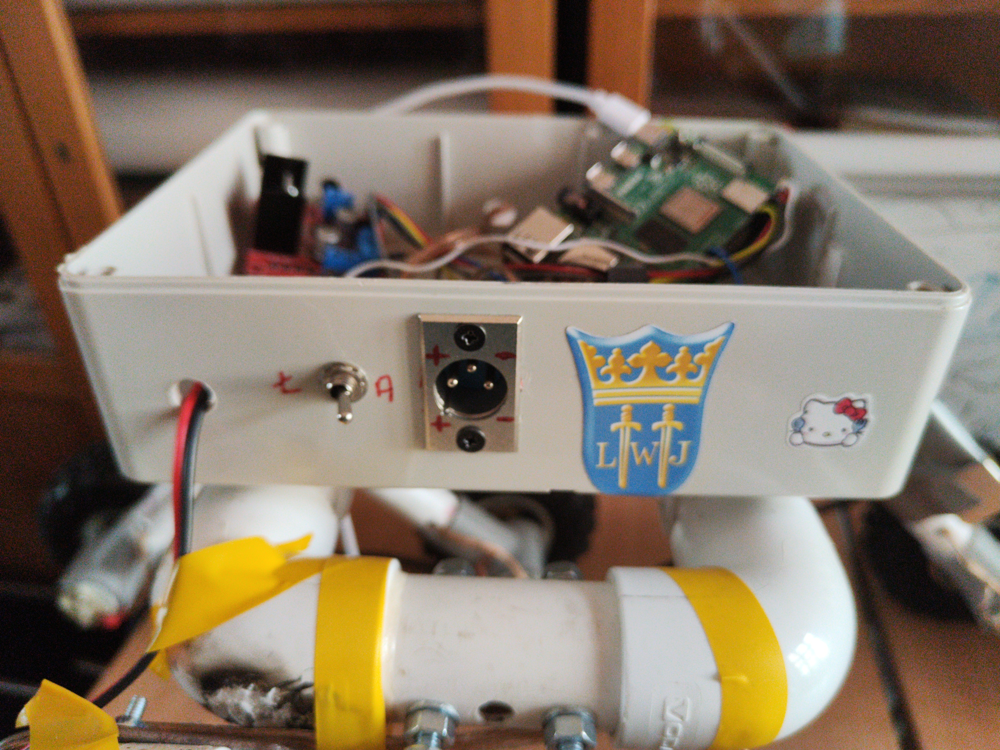
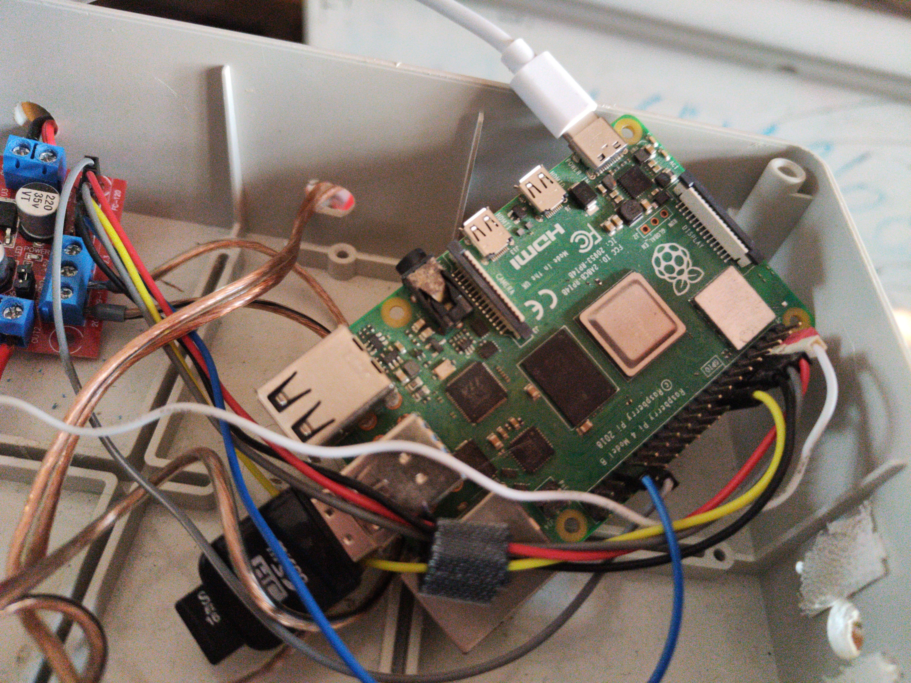

# Łazik
Repozytorium zawiera kod źródłowy, pliki CAD oraz dokumentację łazika

## [Kod](code/)
Kod i jego dokumentacja znajduje się w folderze code/

## [CAD](cad/)
Projekt został zrobiony w programie FreeCAD. Zmontowany łazik jest w pliku `Assembly.FCStd`. Jest tam projekt zawiasu, który nie został jeszcze wydrukowany na drukarce 3D i zmontowany. Model zawiasu nie jest gotowy do wydruku, trzeba dodać offsety aby wszystko się mieściło.

 

 ## Piny
 Aktualne podłączenie pinów\
 https://app.cirkitdesigner.com/project/1267216f-9252-44d6-b0e6-84531952fbf8

 

## Kontroler

Aby sparować kontroler od PS3 z Raspberry Pi należy użyć narzędzia sixpair. Raspberry Pi powinno być wtedy podłączone do zasilacza USB, parowanie może nie działać jeśli jest podłączone do np. komputera jako zasilanie.

Poradnik jak sparować kontroler https://pimylifeup.com/raspberry-pi-playstation-controllers/

## Raspberry Pi
Na Raspberry Pi jest zainstalowany oficjalny Debian 13 Trixie. W folderze `~/code `znajduje się kod źrodłowy programu do sterowania i potrzebnych bibliotek. Port na kartę pamięci jest zepsuty więc trzeba korzystać z przejściówki na USB. Najprościej połączyć się jest przez SSH, ale najpierw trzeba podłączyć PI do innej sieci WIFI za pomocą monitora i klawiatury lub ethernet. Aby łatwo edytować i testować kod polecam użyć rozszerzenia Remote Development do Visual Studio Code.

## Stan techniczny
Aktualnie bateria nie działa. Kamera równierz jest zepsuta, wcześniej była streamowana za pomocą [MediaMTX](https://github.com/bluenviron/mediamtx)

## Zdjęcia

